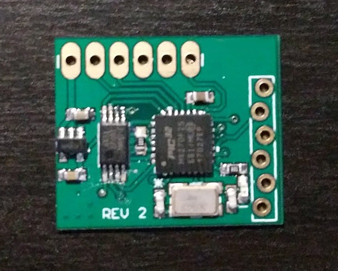
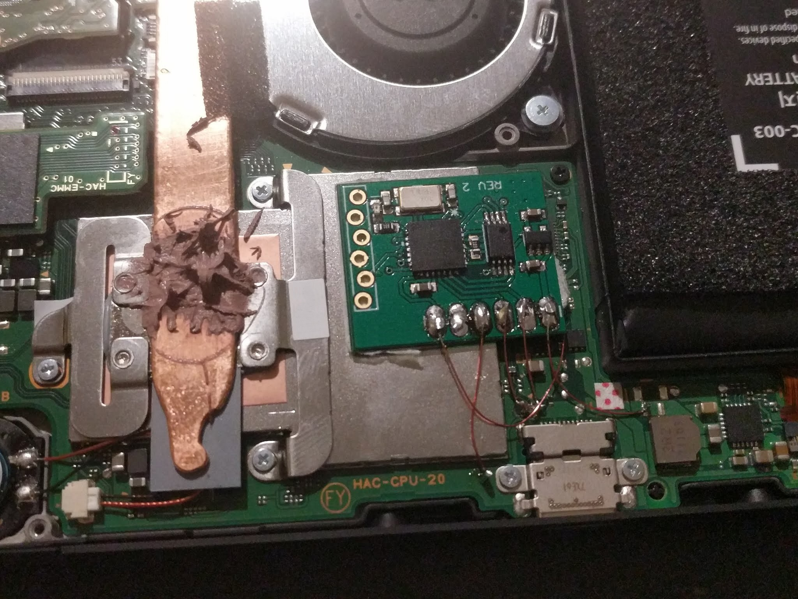

# usbuc
A PIC32 based modchip for the Nintendo Switch.

## Description
This is an experimental WIP modchip designed to fit inside of the Switch that will trigger [Fusee Gelee](https://github.com/reswitched/fusee-launcher) automatically on boot to launch an arbitrary payload. Installing it requires soldering 5 wires.

## Pictures

## Disclaimer
This is a work-in-process, extremely experimental, and has only had limited testing! If you are not comfortable with small soldering and both software and hardware debugging you should not use this! Mistakes can easily result in a permanently damaged Switch!

## Installation Instructions
TODO
